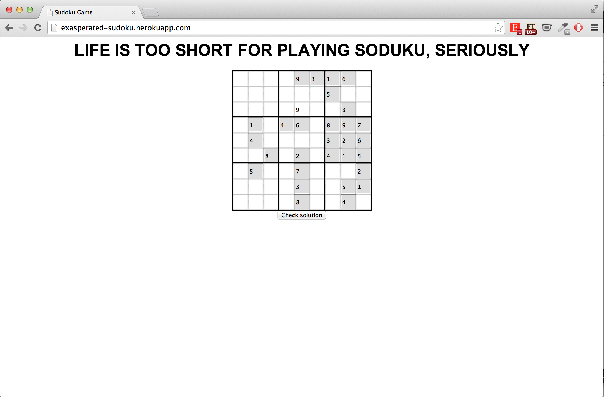
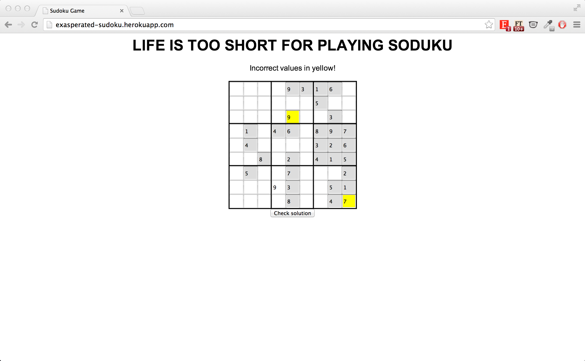

##Soduku Web Application

The goal of this app is to practice working with Sinatra and Heroku. The app is built on a Soduku solver (by [Evengy Shadchnev](https://github.com/shadchnev))which is then capable of checking for solutions based on user input.

New Relic was used to record traffic on the site. 

This task was set by [Evengy Shadchnev](https://github.com/shadchnev). 

(Week 5)

###The app is availble on Heroku, you can play the game [here](http://exasperated-sudoku.herokuapp.com/).

##   

###Home page

###Solver in action!

##Technologies Used
- Ruby
- Sinatra
- Heroku
- New Relic
- HTML
- CSS

##Moving forward 
It would be great to implement a feature whereby users are able to select the level of difficulty they want. 

A button to view the full solution would be desirable as well. 
